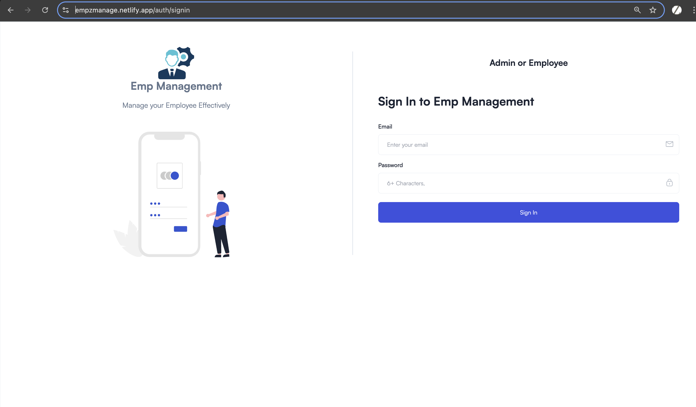
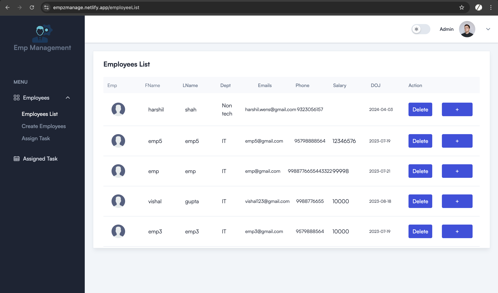
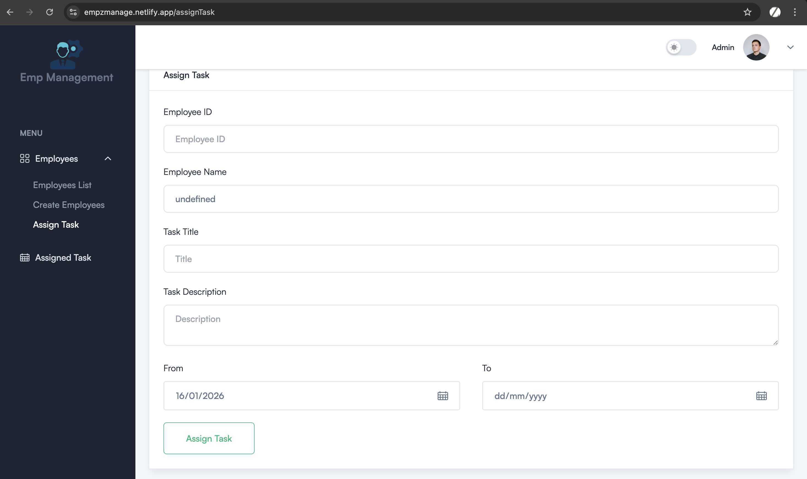
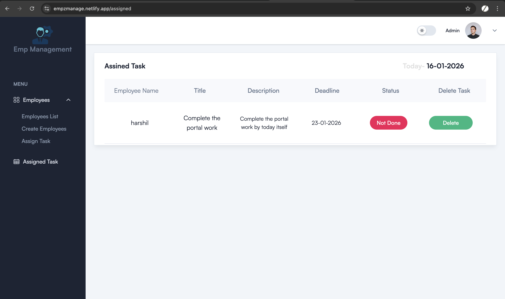
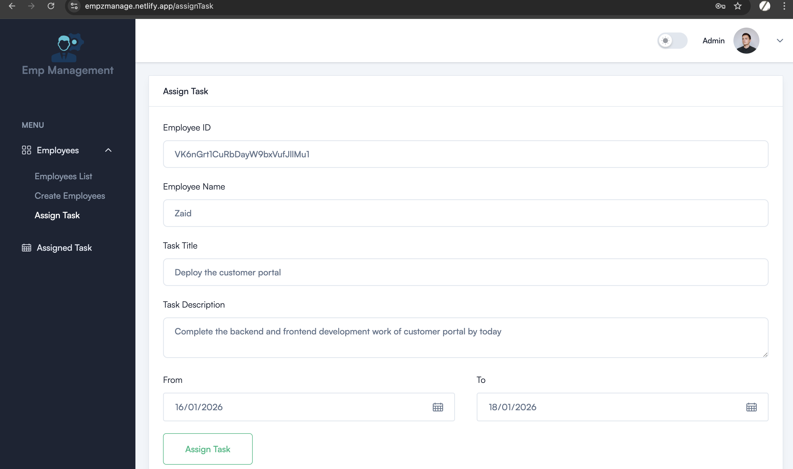
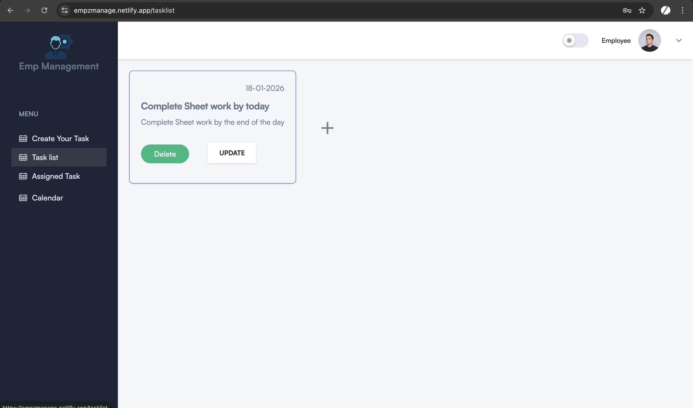
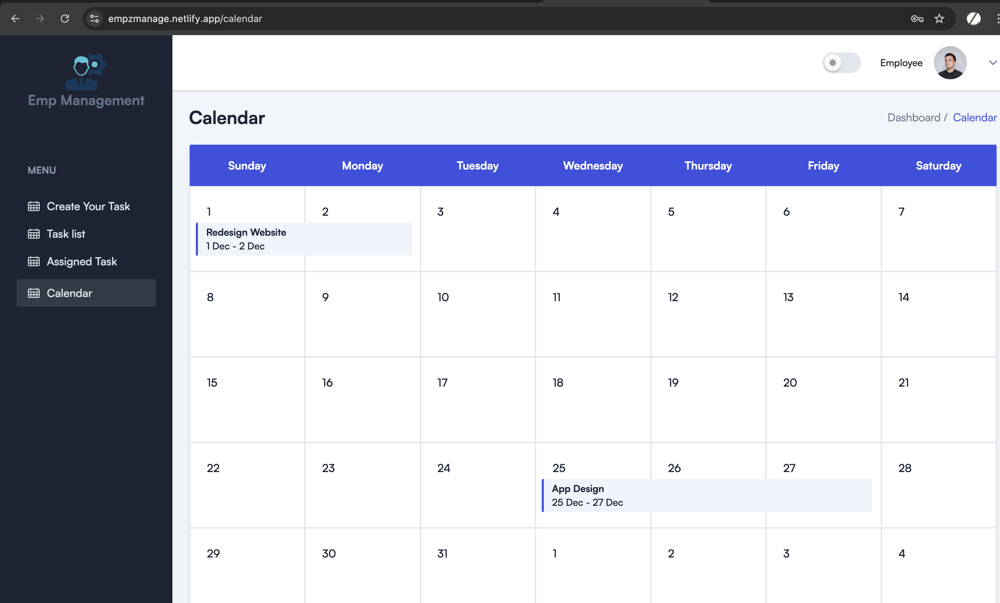
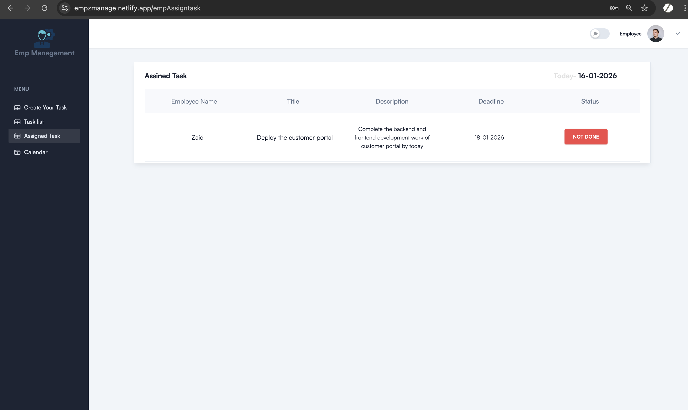

# 🚀 Employee Management & Project Management Portal

A **modern, scalable, and user-friendly multi-portal platform** designed to streamline employee management, task tracking, and communication within an organization.

Built with ❤️ using **React, Redux, Firebase, and Tailwind CSS**, this system provides **separate portals for Admins and Employees**, ensuring clarity, security, and productivity.

---

## ✨ Key Highlights

* 🔐 **Multi-Portal Architecture** (Admin & Employee)
* ⚡ **Real-time Updates** with Firebase
* 🎨 **Clean & Responsive UI** powered by Tailwind CSS
* 🔄 **Centralized State Management** using Redux
* 📱 **Mobile & Desktop Friendly**

---

## 🛠️ Tech Stack

| Technology      | Purpose                            |
| --------------- | ---------------------------------- |
| ⚛️ React        | Frontend UI                        |
| 🧠 Redux        | State Management                   |
| 🔥 Firebase     | Authentication, Database & Hosting |
| 🎨 Tailwind CSS | Styling & Responsiveness           |

---

## 🏢 Admin Portal Features

👨‍💼 Designed for **Managers / Admins** to control and monitor the organization efficiently.

### ✅ Employee Management

* ➕ Create employee profiles
* ✏️ Update employee details
* ❌ Delete employee records

### 📋 Task Management

* 📝 Assign tasks to employees
* 📊 Track task progress & completion status
* ⏱️ Monitor deadlines and productivity

### 💬 Communication

* 💡 Communicate directly with employees
* 🔔 Get real-time updates on task status

---

## 👩‍💻 Employee Portal Features

🙌 Personalized workspace for employees to manage daily work effectively.

### 🗂️ Task Management

* ➕ Create personal tasks
* ✏️ Update existing tasks
* ❌ Delete completed/unnecessary tasks

### 📌 Assigned Tasks

* 👀 View tasks assigned by Admin/Manager
* 🔄 Update task status (Pending / In Progress / Completed)

### 💬 Communication

* 📨 Direct communication with Admin/Manager
* 🤝 Clear collaboration and transparency

### 🗓️ Work Planning

* 📅 Schedule & plan daily or weekly work
* 🧩 Organize tasks efficiently

---

## 🖼️ Application Screenshots

> 📸 **Below are some screenshots showcasing the Admin portals:**








--- 
> 📸 **Below are some screenshots showcasing the Employee portals:**




---

## 🔐 Authentication & Security

* 🔑 Secure authentication using Firebase Auth
* 🧾 Role-based access (Admin vs Employee)
* 🔒 Protected routes for portals

---

## 🚀 Getting Started

```bash
# Clone the repository
git clone https://github.com/your-username/employee-management-portal.git

# Install dependencies
npm install

# Start development server
npm start
```

---

## 🌟 Future Enhancements

* 📈 Performance analytics dashboard
* 📎 File uploads & attachments
* 📧 Email & push notifications
* 🌍 Multi-company support


---

## 🙌 Acknowledgements

Special thanks to:

* ⚛️ React Community
* 🔥 Firebase Team
* 🎨 Tailwind CSS Contributors

---

### ⭐ If you like this project, don’t forget to star the repository!

Happy Coding! 💻✨

